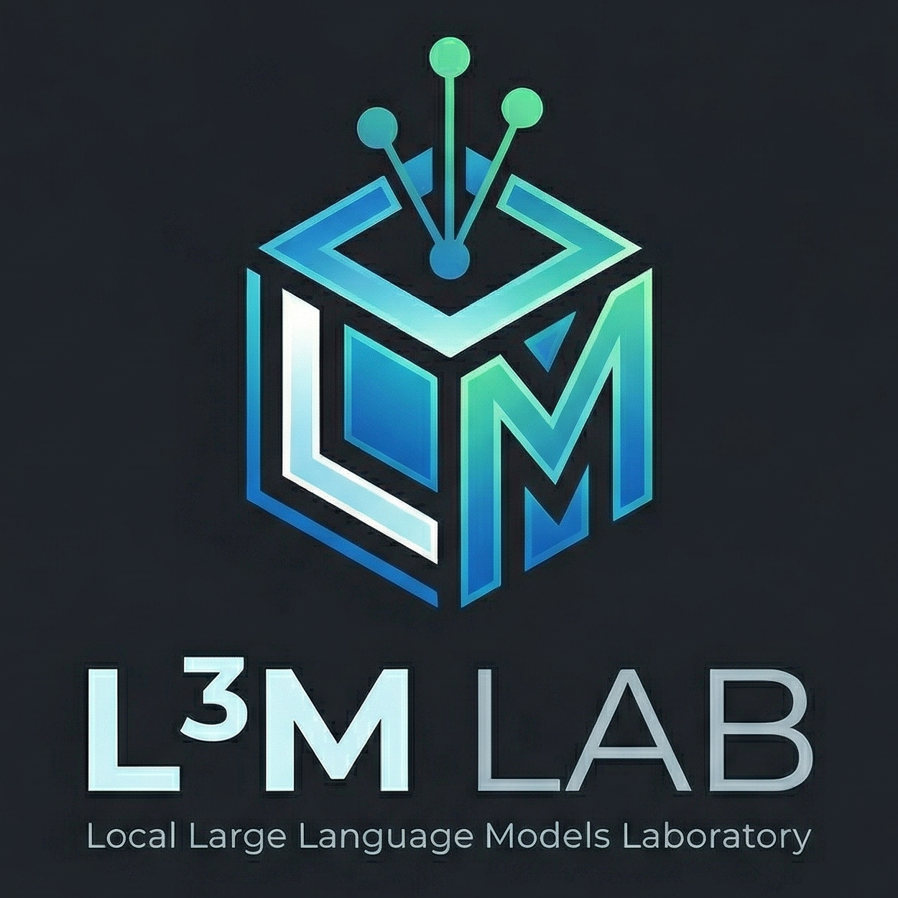
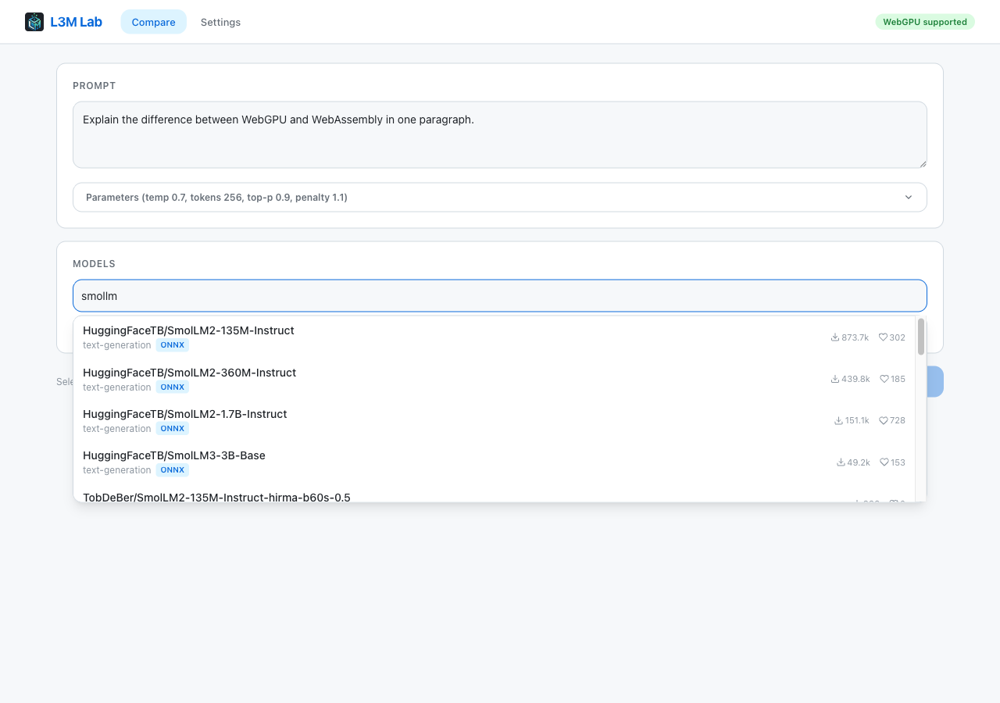
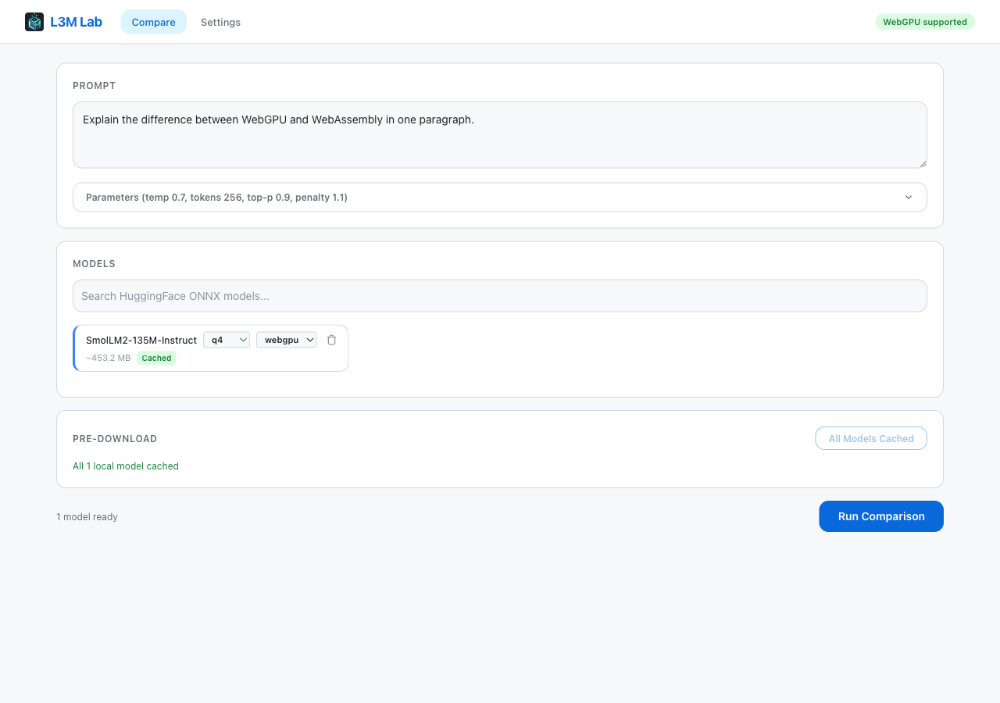
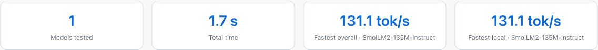
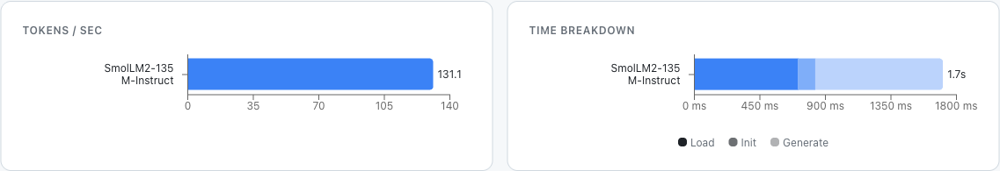
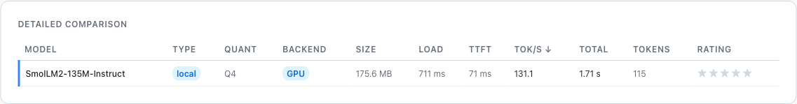
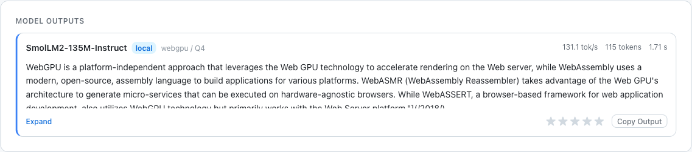
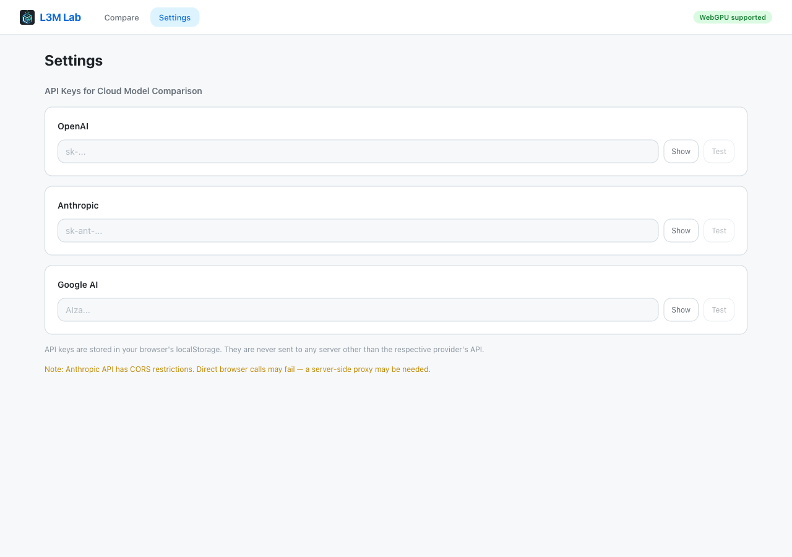

<p align="center">
  
</p>

<h1 align="center">L3M Lab</h1>

<p align="center">
  <em>(L&#179;M) Local Large Language Models Laboratory</em>
</p>

<p align="center">
  Run LLMs directly in your browser and benchmark them against cloud APIs — same prompt, side-by-side results, quantitative metrics.
</p>

---

## What is L3M Lab?

L3M Lab is a browser-based tool for comparing local LLM inference against cloud models, side by side. It runs open-source models entirely in your browser using WebGPU or WebAssembly (via [Transformers.js](https://huggingface.co/docs/transformers.js)), and lets you pit them against cloud APIs from OpenAI, Anthropic, and Google — all with the same prompt, in a single session.

There's no backend. No data leaves your machine unless you explicitly add a cloud model. You write a prompt, pick your models, and get a full performance breakdown with real metrics: tokens per second, time to first token, load time, total generation time.

The goal is simple: give developers and researchers an easy way to see how local models stack up against cloud providers, without setting up infrastructure or writing benchmark scripts.

## Features

- **HuggingFace model search** — Search and select any ONNX model from the HuggingFace Hub directly in the browser
- **WebGPU acceleration** — Run models on the GPU with automatic WASM fallback if WebGPU is unavailable
- **Cloud API support** — Compare against OpenAI (GPT-4o), Anthropic (Claude 3.5), and Google (Gemini 2.0) models
- **Configurable inference** — Set temperature, max tokens, top-p, and repeat penalty per run
- **Live progress tracking** — Real-time status, token count, and speed while models generate
- **Performance charts** — Tokens/sec bar chart and time breakdown (load, init, generate) visualized with Recharts
- **Sortable comparison table** — 11-column table with all metrics, sortable by any column
- **Model output comparison** — Read and rate each model's output side by side
- **Export results** — Download comparison data as JSON, CSV, or Markdown
- **Fully client-side** — No server needed, API keys stored only in your browser's localStorage

## How to Use It

### 1. Write your prompt

Open the app and type a prompt. Optionally tune generation parameters (temperature, max tokens, top-p, repeat penalty) from the collapsible panel.



### 2. Select models

Search for any HuggingFace ONNX model by name. Each model shows downloads, likes, and ONNX compatibility. Once selected, choose quantization (q4, q8, fp16, fp32) and backend (WebGPU or WASM).

If you've configured API keys in Settings, a Cloud Models accordion lets you add GPT-4o, Claude 3.5 Sonnet, Gemini 2.0 Flash, or any custom model ID.



### 3. Run the comparison

Hit **Run Comparison**. Local models are executed in a Web Worker, cloud models call their APIs directly from the browser. You'll see live progress with token count and speed.

### 4. Analyze results

Once complete, you get a full results dashboard:

**Summary cards** — Models tested, total time, fastest overall, fastest local.



**Performance charts** — Tokens/sec and time breakdown (load, init, generate) for each model.



**Comparison table** — Sortable table with model, type, quantization, backend, size, load time, TTFT, tok/s, total time, token count, and star rating.



**Model outputs** — Read each model's generated text side by side, with speed metrics and copy/rating controls.



### 5. Export

Download your results as Markdown, CSV, or JSON for further analysis.

### 6. Configure API keys

Go to **Settings** to add API keys for OpenAI, Anthropic, or Google. Each key can be tested with a connectivity check. Keys are stored in localStorage and never sent anywhere except the respective provider's API.



## How It Works

```
                    ┌──────────────┐
                    │   Browser    │
                    └──────┬───────┘
                           │
              ┌────────────┴────────────┐
              │                         │
     ┌────────▼─────────┐    ┌─────────▼──────────┐
     │    Web Worker     │    │    Main Thread      │
     │  (local models)   │    │   (cloud models)    │
     │                   │    │                     │
     │ @huggingface/     │    │  fetch() to:        │
     │ transformers v4   │    │  - OpenAI API       │
     │ ONNX via WebGPU   │    │  - Anthropic API    │
     │ or WASM fallback  │    │  - Google AI API    │
     └────────┬──────────┘    └─────────┬───────────┘
              │                         │
              └────────────┬────────────┘
                           │
                  ┌────────▼────────┐
                  │  Zustand Store   │
                  │  (results +      │
                  │   metrics)       │
                  └────────┬────────┘
                           │
                  ┌────────▼────────┐
                  │  React UI        │
                  │  Charts, Table,  │
                  │  Outputs, Export │
                  └─────────────────┘
```

**Metrics collected per model**: model size, load time, initialization time, time to first token (TTFT), tokens per second, total generation time, token count.

---

## Getting Started

### Prerequisites

- **Node.js** 18+ and **npm** 9+
- A modern browser: **Chrome 113+** (for WebGPU) or any browser with WebAssembly support

### Installation

```bash
git clone https://github.com/Sgr57/L3M-lab.git
cd L3M-lab
npm install
```

### Development

```bash
npm run dev
```

Open [http://localhost:5173](http://localhost:5173) in your browser.

### Build

```bash
npm run build
npm run preview   # preview the production build
```

### Lint

```bash
npm run lint
```

## Tech Stack

| Technology | Version | Role |
|---|---|---|
| React | 19 | UI framework |
| TypeScript | 6 | Type safety |
| Vite | 8 | Build tool & dev server |
| Tailwind CSS | 4 | Styling |
| Zustand | 5 | State management |
| Recharts | 3 | Performance charts |
| @huggingface/transformers | 4 | Local LLM inference (ONNX) |
| React Router | 7 | Client-side routing |

## Project Structure

```
src/
├── components/          # React components
│   ├── ModelSelector/   # HuggingFace search + cloud model picker
│   ├── PromptInput/     # Prompt textarea + generation parameters
│   ├── TestControls/    # Run/cancel comparison
│   ├── TestProgress/    # Live progress during execution
│   ├── PerformanceCharts/ # Tokens/sec + time breakdown charts
│   ├── ComparisonTable/ # Sortable results table
│   ├── OutputComparison/ # Side-by-side model outputs
│   └── ...
├── pages/               # Route pages (Compare, Settings)
├── stores/              # Zustand stores (compare state, settings)
├── workers/             # Web Worker for local inference
├── lib/                 # Cloud API clients, worker bridge, utilities
├── hooks/               # Custom React hooks
└── types/               # TypeScript type definitions
```

## Contributing

1. Fork the repository
2. Create a feature branch (`git checkout -b feature/my-feature`)
3. Make your changes
4. Run `npm run lint` and `npm run build` to verify
5. Commit your changes
6. Push to your branch and open a Pull Request

## Browser Support

| Feature | Chrome 113+ | Firefox 120+ | Safari 17+ |
|---|---|---|---|
| WebGPU | Yes | No | Partial |
| WebAssembly | Yes | Yes | Yes |
| Cache API | Yes | Yes | Yes |

WebGPU provides significantly faster inference. If unavailable, the app automatically falls back to WASM. The navbar badge shows whether WebGPU is detected in your browser.
